# GitOps with Monitoring

A complete GitOps implementation using ArgoCD on AWS EKS with Prometheus and Grafana monitoring. This project demonstrates automated deployment, continuous synchronization from Git, and comprehensive cluster monitoring.

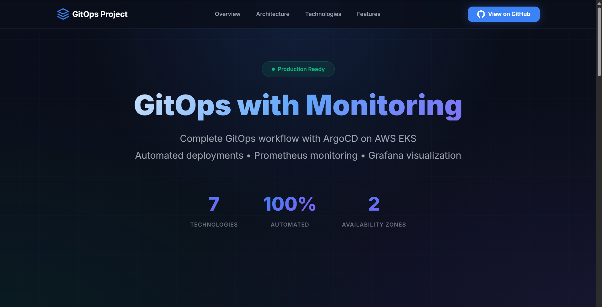

## Technologies

- **Cloud Platform**: AWS EKS (Elastic Kubernetes Service)
- **Infrastructure as Code**: Terraform
- **GitOps**: ArgoCD
- **Monitoring**: Prometheus & Grafana (via Helm)
- **Container Orchestration**: Kubernetes
- **Container Registry**: Docker Hub
- **Application**: Node.js Web Application

---

## Table of Contents

- [Architecture Overview](#architecture-overview)
- [Prerequisites](#prerequisites)
- [Step-by-Step Deployment Guide](#step-by-step-deployment-guide)
  - [Step 1: EC2 Instance Setup](#step-1-ec2-instance-setup)
  - [Step 2: Install Required Tools](#step-2-install-required-tools)
  - [Step 3: Build and Push Docker Image](#step-3-build-and-push-docker-image)
  - [Step 4: Deploy Infrastructure with Terraform](#step-4-deploy-infrastructure-with-terraform)
  - [Step 5: Setup ArgoCD](#step-5-setup-argocd)
  - [Step 6: Deploy Applications](#step-6-deploy-applications)
  - [Step 7: Setup Grafana Dashboards](#step-7-setup-grafana-dashboards)
- [Accessing the Applications](#accessing-the-applications)
- [Cleanup](#cleanup)
- [Troubleshooting](#troubleshooting)
- [Screenshots](#screenshots)

---

## Architecture Overview

This project implements a complete GitOps workflow:

1. **Infrastructure**: AWS EKS cluster provisioned with Terraform
2. **GitOps**: ArgoCD monitors Git repository and auto-deploys changes
3. **Monitoring**: Prometheus collects metrics, Grafana visualizes them
4. **Application**: Sample Node.js web application deployed via ArgoCD

---

## Prerequisites

Before starting, ensure you have:

- **AWS Account** with appropriate permissions (EC2, EKS, VPC, IAM)
- **AWS IAM User** with programmatic access (Access Key & Secret Key)
- **Docker Hub Account** (free tier is sufficient)
- **GitHub Account** (to fork this repository)
- **Basic knowledge** of Kubernetes, Docker, and AWS

---

## Step-by-Step Deployment Guide

### Step 1: EC2 Instance Setup

1. **Launch an EC2 Instance**:
   - AMI: Ubuntu 22.04 LTS
   - Instance Type: `t2.large` or larger (minimum 2 vCPU, 4GB RAM)
   - Storage: 20GB or more
   - Security Group: Allow SSH (port 22) from your IP
   - Create or use an existing key pair for SSH access

2. **Connect to your EC2 instance**:
   ```bash
   ssh -i your-key.pem ubuntu@<EC2-PUBLIC-IP>
   ```

---

### Step 2: Install Required Tools

Run these commands on your EC2 instance:

#### 2.1 Update System
```bash
sudo apt update && sudo apt upgrade -y
```

#### 2.2 Install Docker
```bash
# Install Docker
sudo apt install -y docker.io

# Add user to docker group
sudo usermod -aG docker $USER

# Apply group changes (or logout and login again)
newgrp docker

# Verify Docker installation
docker --version
```

#### 2.3 Install Terraform
```bash
# Download and install Terraform
wget -O - https://apt.releases.hashicorp.com/gpg | sudo gpg --dearmor -o /usr/share/keyrings/hashicorp-archive-keyring.gpg

# Add HashiCorp repository to your system
echo "deb [arch=$(dpkg --print-architecture) signed-by=/usr/share/keyrings/hashicorp-archive-keyring.gpg] https://apt.releases.hashicorp.com $(grep -oP '(?<=UBUNTU_CODENAME=).*' /etc/os-release || lsb_release -cs) main" | sudo tee /etc/apt/sources.list.d/hashicorp.list

# Update package index and install Terraform
sudo apt update && sudo apt install terraform

# Verify Terraform installation
terraform --version
```

#### 2.4 Install AWS CLI
```bash
# Install AWS CLI
sudo snap install aws-cli --classic

# Verify AWS CLI installation
aws --version
```

#### 2.5 Install kubectl
```bash
# Download kubectl
curl -LO "https://dl.k8s.io/release/$(curl -L -s https://dl.k8s.io/release/stable.txt)/bin/linux/amd64/kubectl"

# Install kubectl
sudo install -o root -g root -m 0755 kubectl /usr/local/bin/kubectl

# Verify kubectl installation
kubectl version --client
```

#### 2.5 Install eksctl
```bash
# Install eksctl
curl --silent --location "https://github.com/weaveworks/eksctl/releases/latest/download/eksctl_$(uname -s)_amd64.tar.gz" | tar xz -C /tmp

# Move eksctl to /usr/local/bin
sudo mv /tmp/eksctl /usr/local/bin

# Verify eksctl installation
eksctl version
```

#### 2.6 Install Helm (Optional)
```bash
# Install Helm
curl https://raw.githubusercontent.com/helm/helm/main/scripts/get-helm-3 | bash

# Verify Helm installation
helm version
```

#### 2.7 Configure AWS CLI

```bash
aws configure
```

Enter your AWS credentials:
- AWS Access Key ID: `<your-access-key>`
- AWS Secret Access Key: `<your-secret-key>`
- Default region: `us-east-1` (or your preferred region)
- Default output format: `json`

---

### Step 3: Build and Push Docker Image

#### 3.1 Clone the Repository
```bash
cd ~
git clone https://github.com/Amitabh-DevOps/GitOps-with-monitoring.git
cd GitOps-with-monitoring
```

#### 3.2 Login to Docker Hub
```bash
docker login
```
Enter your Docker Hub username and password.

#### 3.3 Build the Docker Image
```bash
cd app
docker build -t <your-dockerhub-username>/gitops-webapp:latest .
```

#### 3.4 Push the Image to Docker Hub
```bash
docker push <your-dockerhub-username>/gitops-webapp:latest
```

#### 3.5 Update the Deployment Manifest
Edit `manifests/deployment.yaml` and replace the image with your Docker Hub image:
```yaml
image: <your-dockerhub-username>/gitops-webapp:latest
```

Commit and push the changes:
```bash
git add manifests/deployment.yaml
git commit -m "Updated Docker image"
git push origin main
```

---

### Step 4: Deploy Infrastructure with Terraform

#### 4.1 Initialize Terraform
```bash
cd ~/GitOps-with-monitoring/terraform
terraform init
```

#### 4.2 Review the Terraform Plan
```bash
terraform plan
```

#### 4.3 Apply Terraform Configuration
```bash
terraform apply --auto-approve
```

This will create:
- VPC with public and private subnets
- EKS cluster (Kubernetes 1.32)
- EKS managed node group (2 t3.medium instances)
- Required IAM roles and security groups

**Note**: This process takes approximately 15-20 minutes.

#### 4.4 Configure kubectl
After Terraform completes, run the command from the output:
```bash
aws eks update-kubeconfig --name gitops-with-monitoring --region us-east-1
```

#### 4.5 Verify Cluster Access
```bash
kubectl get nodes
```

You should see 2 nodes in `Ready` state.

- AWS EKS Cluster
    
    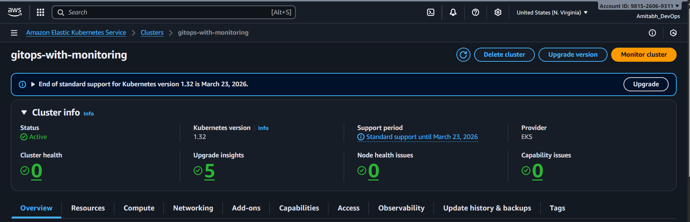

- AWS EKS Cluster & Nodes
    
    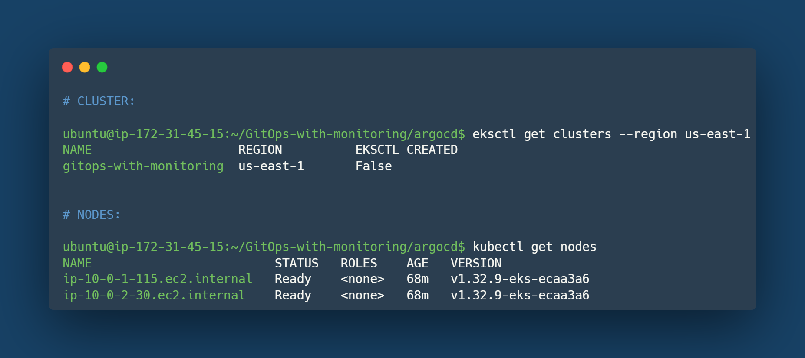

- Pods & Services in `argocd` Namespace
    
    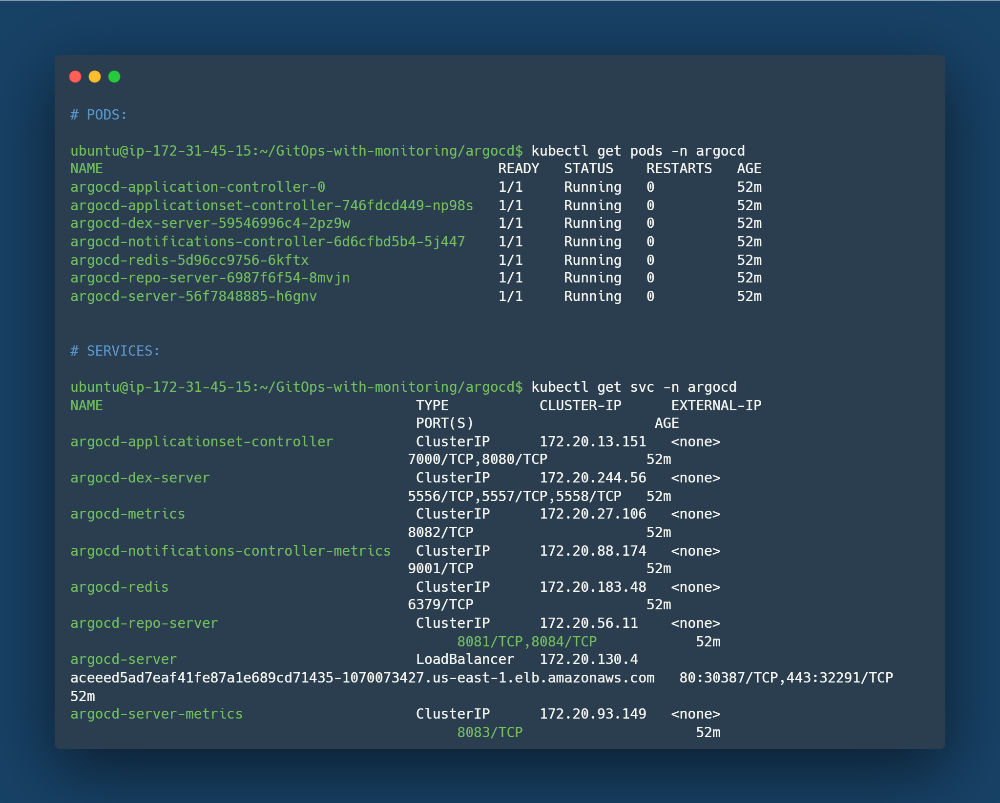

---

### Step 5: Setup ArgoCD

#### 5.1 Install ArgoCD
```bash
# Create namespace
kubectl create namespace argocd

# Install ArgoCD
kubectl apply -n argocd -f https://raw.githubusercontent.com/argoproj/argo-cd/stable/manifests/install.yaml

# Wait for ArgoCD pods to be ready
kubectl wait --for=condition=ready pod -l app.kubernetes.io/name=argocd-server -n argocd --timeout=300s
```

#### 5.2 Expose ArgoCD Server via LoadBalancer
```bash
kubectl patch svc argocd-server -n argocd -p '{"spec": {"type": "LoadBalancer"}}'
```

#### 5.3 Get ArgoCD LoadBalancer URL
```bash
kubectl get svc argocd-server -n argocd
```

Wait for the `EXTERNAL-IP` to be assigned (takes 2-3 minutes). Copy the LoadBalancer DNS name.

#### 5.4 Get ArgoCD Admin Password
```bash
kubectl -n argocd get secret argocd-initial-admin-secret -o jsonpath="{.data.password}" | base64 -d && echo
```

#### 5.5 Access ArgoCD UI
Open your browser and navigate to:
```
https://<ARGOCD-LOADBALANCER-URL>
```

**Login Credentials**:
- Username: `admin`
- Password: (from step 5.4)

**Note**: You may see a certificate warning - this is expected. Click "Advanced" and proceed.

---

### Step 6: Deploy Applications

#### 6.1 Deploy ArgoCD Applications
```bash
cd ~/GitOps-with-monitoring/argocd
kubectl apply -f app.yaml
kubectl apply -f monitoring.yaml
```

#### 6.2 Verify Applications in ArgoCD UI
1. Go to ArgoCD UI
2. You should see two applications:
   - `webapp` - Your Node.js application
   - `monitoring` - Prometheus & Grafana stack

        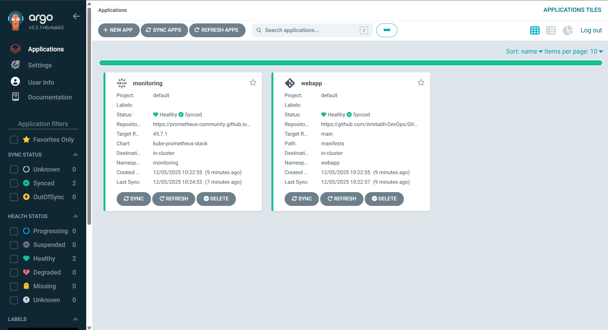

3. Click on each application to see the deployment status

    - `webapp`:
        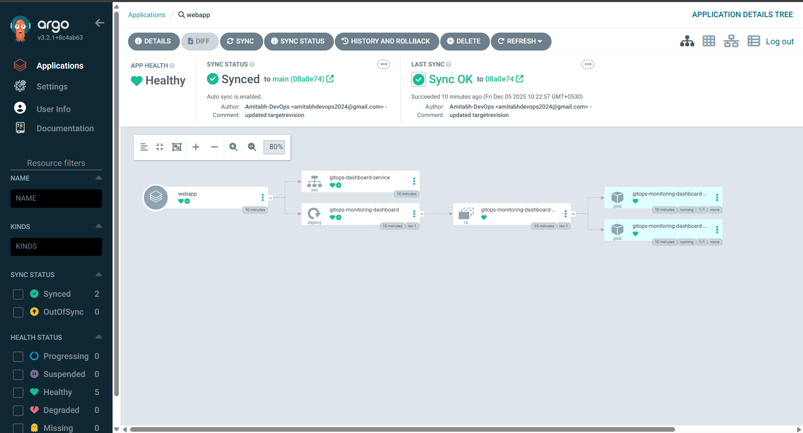

    - `monitoring`:
        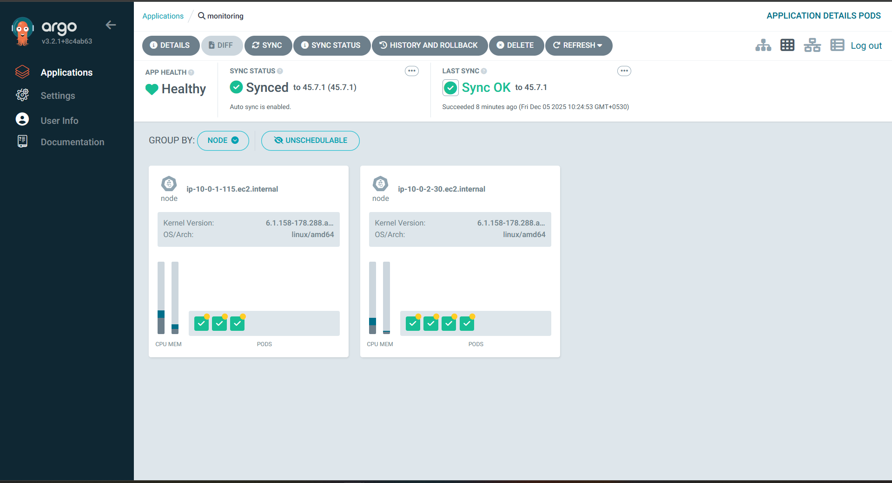

4. Wait for both applications to show "Healthy" and "Synced"

#### 6.3 Verify Pods
```bash
# Check webapp namespace
kubectl get pods -n webapp

# Check monitoring namespace
kubectl get pods -n monitoring
```

- Pods & Services -n webapp

    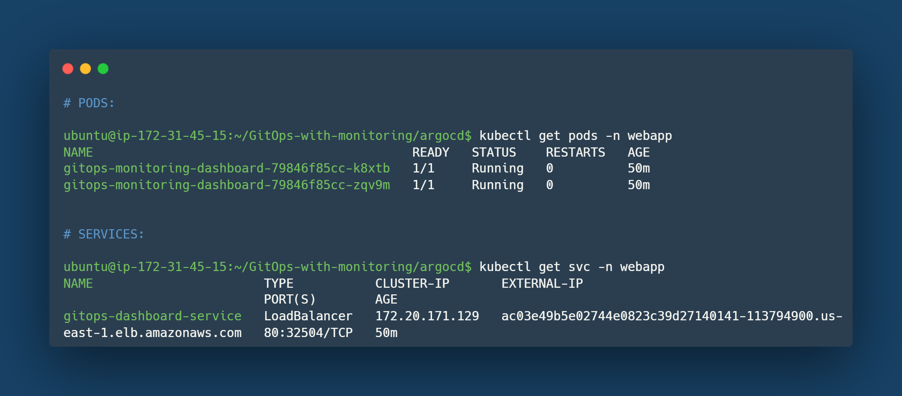

- Pods & Services -n monitoring

    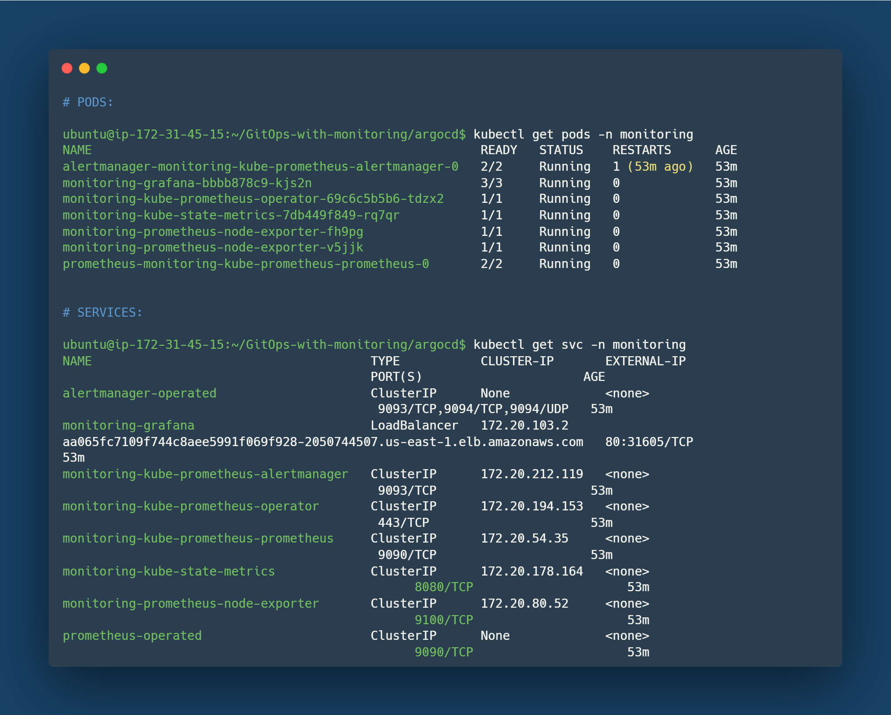

---

### Step 7: Setup Grafana Dashboards

#### 7.1 Get Grafana LoadBalancer URL
```bash
kubectl get svc -n monitoring monitoring-grafana
```

#### 7.2 Get Grafana Admin Password or use: admin123
```bash
kubectl get secret -n monitoring monitoring-grafana -o jsonpath="{.data.admin-password}" | base64 -d && echo
```

#### 7.3 Access Grafana UI
Open your browser and navigate to:
```
http://<GRAFANA-LOADBALANCER-URL>
```

**Login Credentials**:
- Username: `admin`
- Password: `admin123`

#### 7.4 Setup ArgoCD Monitoring
```bash
cd ~/GitOps-with-monitoring/argocd
kubectl apply -f service-monitor.yaml
```

This creates ServiceMonitors for ArgoCD metrics in Prometheus.

#### 7.5 Import Dashboards

**Dashboard 1: ArgoCD Monitoring**
1. In Grafana, Go to Dashboards and click the "New" button → "Import"
2. Enter Dashboard ID: `14584`
3. Click "Load"
4. Select Prometheus data source: `Prometheus`
5. Click "Import"
6. You will see the ArgoCD monitoring metrics:
    
    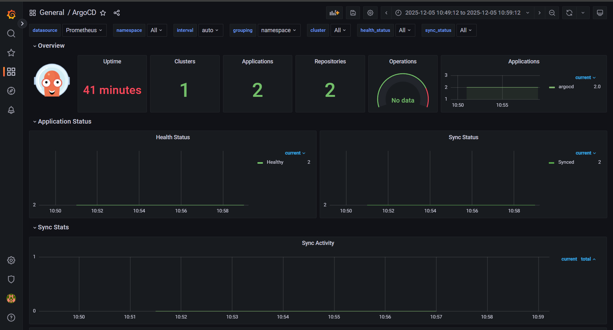

**Dashboard 2: ArgoCD Operationa/Overview**
1. In Grafana, Go to Dashboards and click the "New" button → "Import"
2. Enter Dashboard ID: `19993`
3. Click "Load"
4. Select Prometheus data source: `Prometheus`
5. Click "Import"
6. You will see the ArgoCD operationa/overview metrics:
    
    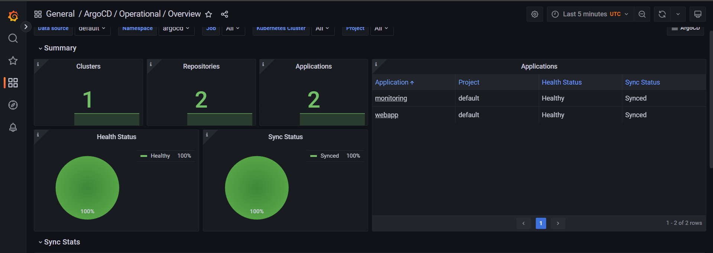

    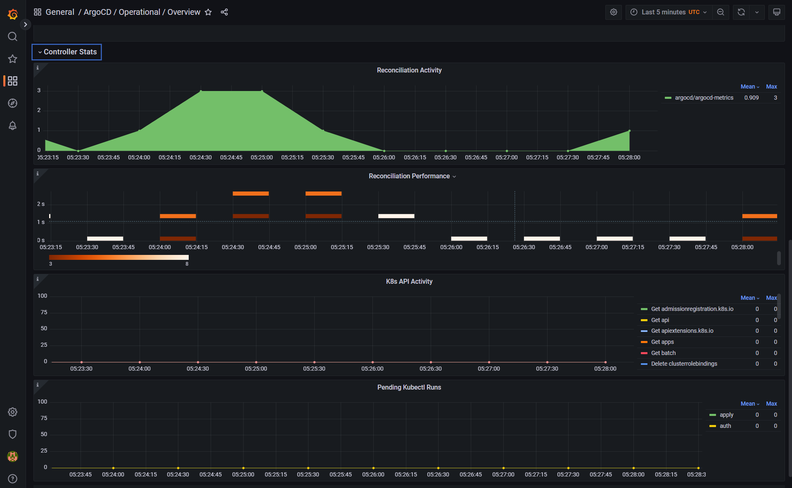

    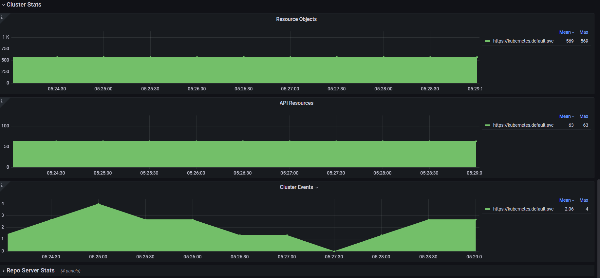

    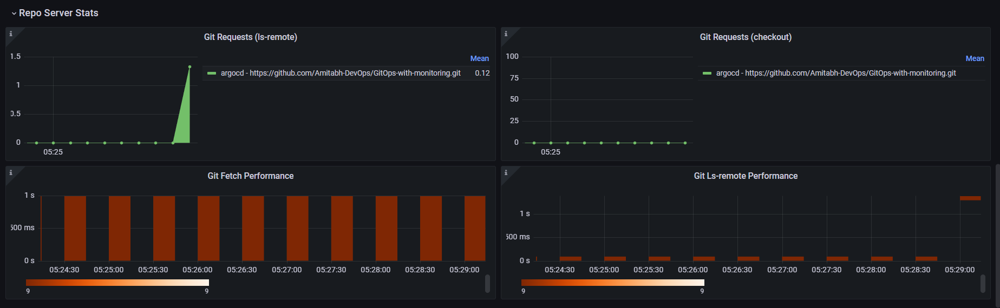

**Dashboard 3: Kuberenetes/Compute Resources/ Cluster Usage**
1. In Grafana, Go to Dashboards → General
2. Select `Kubernetes / Compute Resources / Cluster` from the list
3. You will see the cluster usage metrics:
    
    

---

## Accessing the Applications

After deployment, you can access:

| Application | URL | Credentials |
|-------------|-----|-------------|
| **ArgoCD** | `https://<argocd-loadbalancer>` | Username: `admin`<br>Password: (from kubectl secret) |
| **Grafana** | `http://<grafana-loadbalancer>` | Username: `admin`<br>Password: (from kubectl secret) |
| **Web App** | `http://<webapp-loadbalancer>` | N/A |

To get the Web App LoadBalancer URL:
```bash
kubectl get svc -n webapp
```

- Open that Web App LoadBalancer URL in your browser:

    

    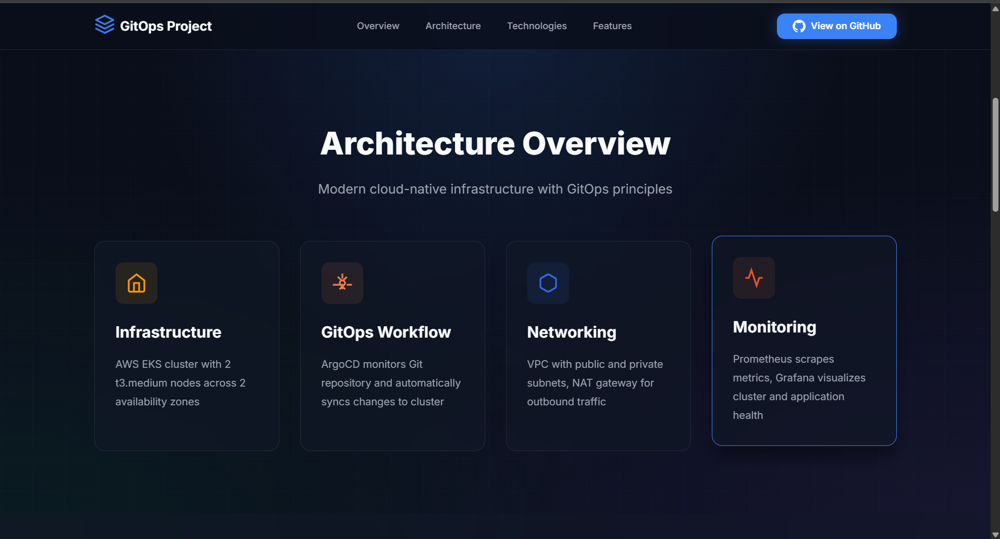

    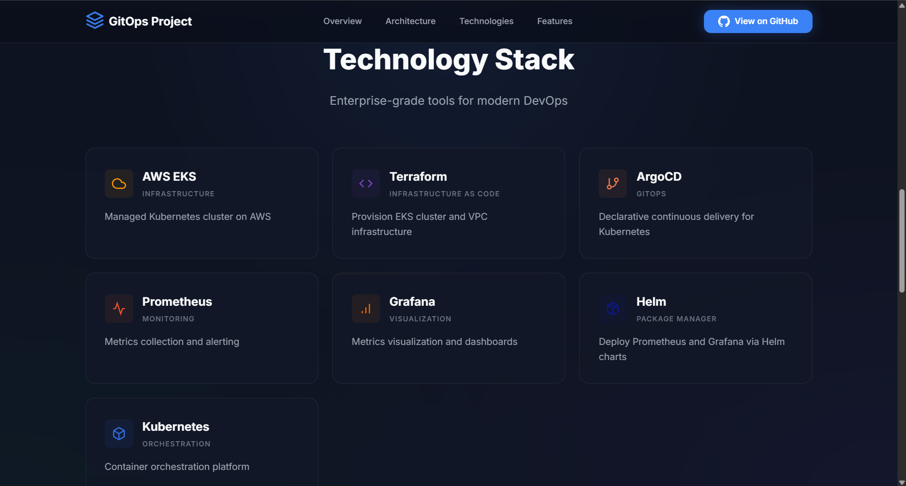

    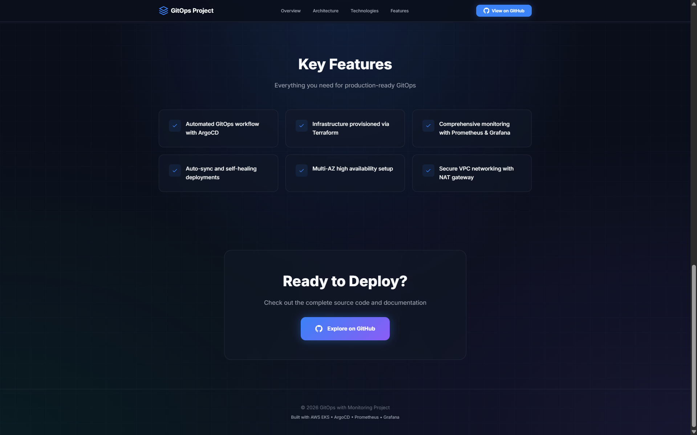

---

## Cleanup

To avoid AWS charges, delete all resources when done:

### Step 1: Delete Kubernetes LoadBalancers
```bash
# Delete ArgoCD LoadBalancer
kubectl delete svc argocd-server -n argocd

# Delete Grafana LoadBalancer
kubectl patch svc monitoring-grafana -n monitoring -p '{"spec": {"type": "ClusterIP"}}'

# Delete any LoadBalancers in webapp namespace
kubectl delete svc -n webapp --all

# Wait 2-3 minutes for AWS to clean up LoadBalancers
```

### Step 2: Destroy Terraform Infrastructure
```bash
cd ~/GitOps-with-monitoring/terraform
terraform destroy --auto-approve
```

**Note**: If `terraform destroy` hangs, it's likely due to orphaned LoadBalancers. Check AWS Console → EC2 → Load Balancers and delete any remaining load balancers manually, then retry.

---

## Troubleshooting

### Issue 1: Terraform Destroy Hangs

**Cause**: Kubernetes created LoadBalancers that Terraform doesn't track.

**Solution**:
```bash
# List all Classic Load Balancers in VPC
aws elb describe-load-balancers --region us-east-1 --query 'LoadBalancerDescriptions[?VPCId==`<VPC-ID>`].LoadBalancerName' --output text

# Delete each LoadBalancer
aws elb delete-load-balancer --load-balancer-name <LB-NAME> --region us-east-1

# Wait 2-3 minutes, then retry terraform destroy
```

### Issue 2: ArgoCD Applications Not Syncing

**Cause**: Repository URL or path mismatch.

**Solution**:
1. Check ArgoCD application YAML files
2. Ensure `repoURL` points to your forked repository
3. Verify `path` matches the directory structure
4. Manually sync in ArgoCD UI

### Issue 3: Pods in CrashLoopBackOff

**Cause**: Image pull errors or configuration issues.

**Solution**:
```bash
# Check pod logs
kubectl logs <pod-name> -n <namespace>

# Describe pod for events
kubectl describe pod <pod-name> -n <namespace>
```

### Issue 4: Cannot Access LoadBalancer URL

**Cause**: Security group restrictions or LoadBalancer not ready.

**Solution**:
1. Wait 2-3 minutes for LoadBalancer to be fully provisioned
2. Check AWS Console → EC2 → Load Balancers for status
3. Verify security groups allow inbound traffic

---

## 📝 Notes

- **Cost**: Running this setup will incur AWS charges (approximately $2-3/day for the EKS cluster and EC2 instances)
- **Security**: This is a demo setup. For production, implement proper security measures (private subnets, network policies, RBAC, etc.)
- **Customization**: Feel free to modify the Terraform variables, Kubernetes manifests, and ArgoCD applications to suit your needs

---

## 🤝 Contributing

Contributions are welcome! Please feel free to submit a Pull Request.

---

## 📄 License

This project is open source and available under the MIT License.

---

## 👤 Author

**Amitabh**
- GitHub: [@Amitabh-DevOps](https://github.com/Amitabh-DevOps)

---

## ⭐ Show Your Support

Give a ⭐️ if this project helped you!